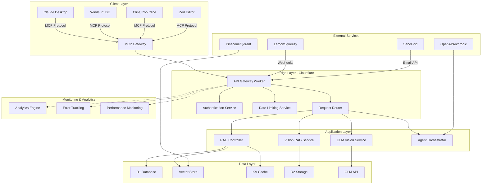
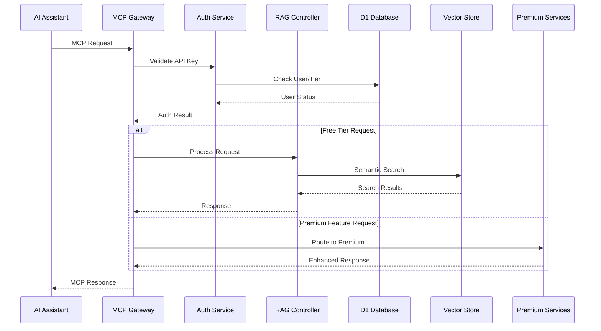
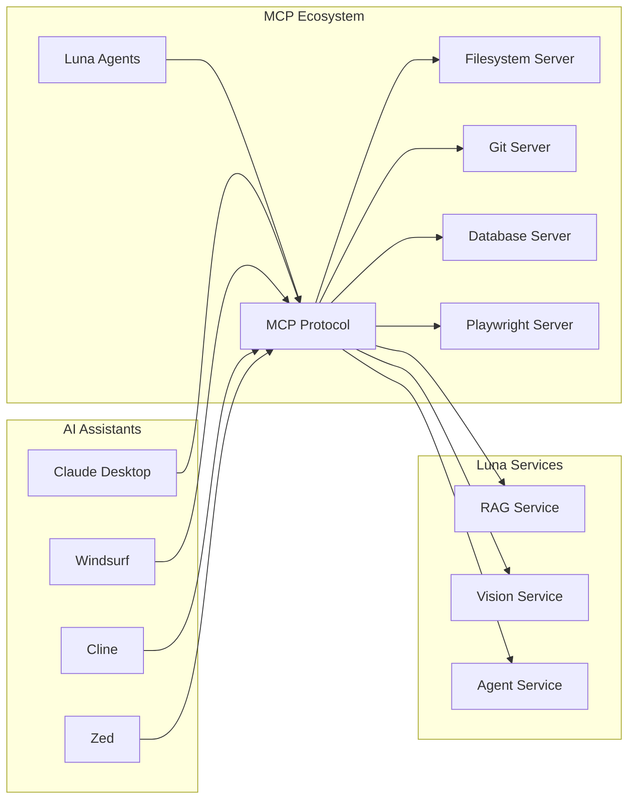
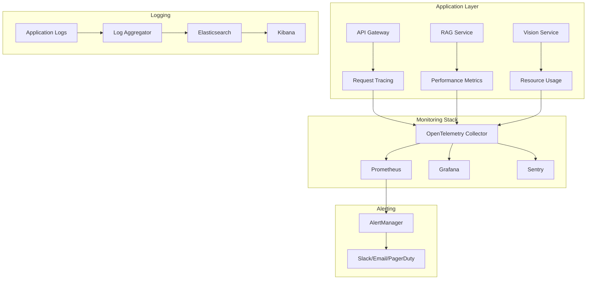
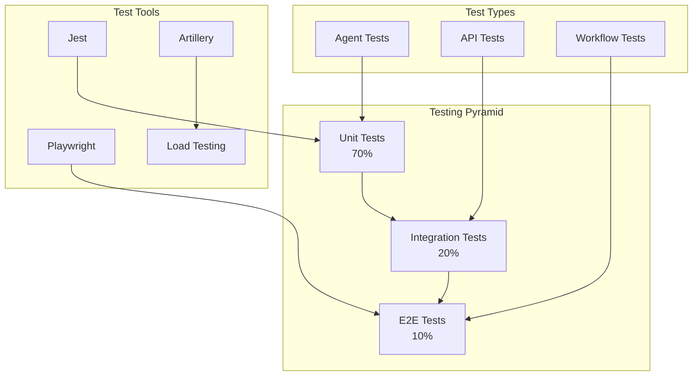

# 🌙 Luna Agents - Technical Design Specification

**Project**: Luna Agents - AI-Powered Development Lifecycle Management System
**Date**: November 10, 2025
**Version**: 2.0
**Status**: Production-Ready Architecture

---

## 📋 Executive Overview

Luna Agents is a cloud-native, multi-component AI system built on MCP (Model Context Protocol) architecture that provides comprehensive automation of the software development lifecycle. The system leverages serverless computing, edge computing, and semantic search technologies to deliver a scalable, performant platform for developers and teams.

### Key Architectural Decisions

1. **Serverless-First Architecture**: Built on Cloudflare Workers for global distribution and automatic scaling
2. **MCP Protocol Integration**: Universal compatibility with AI coding assistants through standardized protocol
3. **Premium Feature Separation**: Clear distinction between free and premium features with cloud-based processing
4. **Edge-Optimized Performance**: Sub-500ms response times through global CDN and edge computing
5. **Event-Driven Design**: Asynchronous processing for scalability and resilience

---

## 🏗️ High-Level System Architecture



### Component Interaction Flow



---

## 🔧 Core System Components

### 1. MCP Gateway Service

**Location**: `api-gateway.worker.js`
**Purpose**: Central entry point for all MCP-compatible clients

```javascript
// Core MCP Gateway implementation
class MCPGateway {
  constructor(env) {
    this.auth = new AuthService(env);
    this.router = new RequestRouter(env);
    this.rateLimiter = new RateLimiter(env);
  }

  async handleRequest(request) {
    // 1. Authenticate request
    const auth = await this.auth.validate(request);

    // 2. Apply rate limiting
    await this.rateLimiter.check(auth.user);

    // 3. Route to appropriate service
    return await this.router.route(request, auth);
  }
}
```

**Key Responsibilities**:
- MCP protocol compliance
- Request validation and routing
- Authentication and authorization
- Rate limiting and quota management
- Response formatting

### 2. RAG Controller

**Location**: `backend/src/rag-controller.js`
**Purpose**: Core semantic search and context retrieval

```javascript
class RAGController {
  constructor(env) {
    this.db = new DatabaseService(env);
    this.vectorStore = new VectorStore(env);
    this.cache = new CacheService(env);
    this.openai = new OpenAIService(env);
  }

  async handleRAGQuery(userId, query, apiKey, sessionId) {
    // 1. Validate user and quota
    const user = await this.validateUser(userId, apiKey);

    // 2. Check cache first
    const cached = await this.cache.get(query, userId);
    if (cached) return cached;

    // 3. Generate embedding
    const embedding = await this.openai.createEmbedding(query);

    // 4. Search vector database
    const results = await this.vectorStore.search(embedding, user.tier);

    // 5. Generate context-aware response
    const response = await this.generateResponse(query, results);

    // 6. Cache and log usage
    await this.cache.set(query, response, userId);
    await this.logUsage(userId, 'rag_query');

    return response;
  }
}
```

### 3. Vision RAG Service

**Location**: `vision-rag.worker.js`
**Purpose**: Cloud-based visual analysis and screenshot-to-code conversion

```javascript
class VisionRAGService {
  constructor(env) {
    this.r2 = new R2Service(env);
    this.vision = new VisionAnalyzer(env);
    this.rag = new RAGIntegration(env);
  }

  async analyzeScreenshot(screenshotBuffer, context) {
    // 1. Store screenshot in R2
    const screenshotUrl = await this.r2.upload(screenshotBuffer);

    // 2. Perform visual analysis
    const visualAnalysis = await this.vision.analyze(screenshotUrl);

    // 3. Extract UI components
    const components = await this.extractComponents(visualAnalysis);

    // 4. Search for similar implementations
    const codeMatches = await this.rag.searchComponents(components);

    // 5. Generate code suggestions
    return await this.generateCodeSuggestions(visualAnalysis, codeMatches);
  }
}
```

### 4. Agent Orchestrator

**Location**: `agent-orchestrator.worker.js`
**Purpose**: Manages and coordinates 15+ specialized AI agents

```javascript
class AgentOrchestrator {
  constructor() {
    this.agents = {
      requirements: new RequirementsAnalyzer(),
      design: new DesignArchitect(),
      planning: new TaskPlanner(),
      execution: new TaskExecutor(),
      review: new CodeReviewer(),
      testing: new TestingValidator(),
      deployment: new DeploymentAgent(),
      documentation: new DocumentationGenerator(),
      monitoring: new MonitoringAgent(),
      postLaunch: new PostLaunchReviewer()
    };
  }

  async executeWorkflow(workflowType, context) {
    const workflow = this.getWorkflow(workflowType);
    const results = {};

    for (const [stage, agent] of workflow) {
      results[stage] = await agent.execute(context, results);
      context = { ...context, ...results[stage] };
    }

    return results;
  }
}
```

---

## 🗄️ Data Architecture

### Database Schema Design

#### Users Table
```sql
CREATE TABLE users (
    id TEXT PRIMARY KEY,
    email TEXT UNIQUE NOT NULL,
    user_id TEXT UNIQUE NOT NULL,
    tier ENUM('free', 'pro', 'enterprise') DEFAULT 'free',
    api_key TEXT UNIQUE,
    subscription_id TEXT,
    subscription_status ENUM('trial', 'active', 'cancelled', 'expired') DEFAULT 'trial',
    trial_started_at DATETIME,
    trial_ends_at DATETIME,
    subscription_created_at DATETIME,
    cancelled_at DATETIME,
    created_at DATETIME DEFAULT CURRENT_TIMESTAMP,
    updated_at DATETIME DEFAULT CURRENT_TIMESTAMP,

    INDEX idx_users_email (email),
    INDEX idx_users_api_key (api_key),
    INDEX idx_users_tier (tier),
    INDEX idx_users_subscription_id (subscription_id),
    INDEX idx_users_trial_ends_at (trial_ends_at)
);
```

#### Usage Statistics Table
```sql
CREATE TABLE usage_stats (
    id INTEGER PRIMARY KEY AUTOINCREMENT,
    user_id TEXT NOT NULL,
    date DATE NOT NULL,
    feature TEXT NOT NULL,
    usage_count INTEGER DEFAULT 0,
    metadata JSON,
    created_at DATETIME DEFAULT CURRENT_TIMESTAMP,

    FOREIGN KEY (user_id) REFERENCES users(user_id),
    INDEX idx_usage_user_date (user_id, date),
    INDEX idx_usage_feature_date (feature, date),
    UNIQUE KEY unique_user_feature_date (user_id, date, feature)
);
```

#### Conversations Table
```sql
CREATE TABLE conversations (
    id TEXT PRIMARY KEY,
    user_id TEXT NOT NULL,
    session_id TEXT,
    message_type ENUM('query', 'response', 'system'),
    content TEXT NOT NULL,
    tokens_used INTEGER,
    model_used TEXT,
    response_time_ms INTEGER,
    metadata JSON,
    created_at DATETIME DEFAULT CURRENT_TIMESTAMP,

    FOREIGN KEY (user_id) REFERENCES users(user_id),
    INDEX idx_conversations_user_session (user_id, session_id),
    INDEX idx_conversations_created_at (created_at),
    INDEX idx_conversations_type (message_type)
);
```

#### Licenses Table (Enterprise)
```sql
CREATE TABLE licenses (
    id TEXT PRIMARY KEY,
    user_id TEXT NOT NULL,
    license_key TEXT UNIQUE NOT NULL,
    tier ENUM('pro', 'enterprise') NOT NULL,
    seats INTEGER DEFAULT 1,
    used_seats INTEGER DEFAULT 0,
    valid_from DATETIME NOT NULL,
    valid_until DATETIME NOT NULL,
    features JSON,
    restrictions JSON,
    created_at DATETIME DEFAULT CURRENT_TIMESTAMP,
    updated_at DATETIME DEFAULT CURRENT_TIMESTAMP,

    FOREIGN KEY (user_id) REFERENCES users(user_id),
    INDEX idx_licenses_key (license_key),
    INDEX idx_licenses_user (user_id),
    INDEX idx_licenses_validity (valid_from, valid_until)
);
```

### Data Models and Relationships

```typescript
// User Model
interface User {
  id: string;
  email: string;
  userId: string;
  tier: 'free' | 'pro' | 'enterprise';
  apiKey?: string;
  subscription?: Subscription;
  usage: UsageStats[];
  createdAt: Date;
  updatedAt: Date;
}

// Subscription Model
interface Subscription {
  id: string;
  status: 'trial' | 'active' | 'cancelled' | 'expired';
  tier: 'free' | 'pro' | 'enterprise';
  trialEndsAt?: Date;
  createdAt: Date;
  cancelledAt?: Date;
}

// Usage Statistics Model
interface UsageStats {
  userId: string;
  date: string;
  ragQueries: number;
  visionAnalyses: number;
  codeReviews: number;
  deployments: number;
  storageUsed: number; // bytes
}

// Conversation Model
interface Conversation {
  id: string;
  userId: string;
  sessionId: string;
  type: 'query' | 'response' | 'system';
  content: string;
  tokensUsed?: number;
  modelUsed: string;
  responseTime: number;
  metadata: Record<string, any>;
}
```

### Vector Database Schema

```typescript
// Code Embedding Structure
interface CodeEmbedding {
  id: string;
  projectId: string;
  filePath: string;
  functionName?: string;
  className?: string;
  code: string;
  language: string;
  embedding: number[]; // 1536-dimensional vector
  metadata: {
    complexity: number;
    dependencies: string[];
    testCoverage: boolean;
    lastModified: Date;
  };
}

// Documentation Embedding
interface DocEmbedding {
  id: string;
  type: 'readme' | 'api' | 'guide' | 'comment';
  content: string;
  source: string;
  embedding: number[];
  metadata: {
    title: string;
    section?: string;
    tags: string[];
  };
}
```

---

## 🔌 API Design Specification

### REST API Endpoints

#### Authentication Endpoints
```typescript
// POST /api/auth/verify
interface VerifyRequest {
  apiKey?: string;
  userId?: string;
}

interface VerifyResponse {
  success: boolean;
  user: {
    id: string;
    email: string;
    tier: 'free' | 'pro' | 'enterprise';
    subscriptionStatus: string;
    remainingQuota: {
      ragQueries: number;
      visionAnalyses: number;
    };
  };
}
```

#### RAG Query Endpoints
```typescript
// POST /api/query
interface QueryRequest {
  userId: string;
  message: string;
  apiKey?: string;
  sessionId?: string;
  context?: {
    projectId?: string;
    files?: string[];
    scope?: 'project' | 'feature';
  };
}

interface QueryResponse {
  success: boolean;
  response: {
    answer: string;
    sources: Array<{
      file: string;
      line: number;
      snippet: string;
      confidence: number;
    }>;
    relatedCode: Array<{
      file: string;
      description: string;
    }>;
    suggestions: string[];
  };
  usage: {
    tokensUsed: number;
    responseTime: number;
  };
}
```

#### Vision Analysis Endpoints
```typescript
// POST /api/vision/analyze
interface VisionRequest {
  userId: string;
  image: string; // base64 or URL
  type: 'screenshot' | 'design' | 'ui-test';
  apiKey: string;
  context?: {
    project?: string;
    framework?: string;
    requirements?: string[];
  };
}

interface VisionResponse {
  success: boolean;
  analysis: {
    elements: Array<{
      type: string;
      bounds: { x: number; y: number; width: number; height: number };
      properties: Record<string, any>;
    }>;
    components: Array<{
      name: string;
      implementation: string;
      framework: string;
    }>;
    issues: Array<{
      type: 'accessibility' | 'responsive' | 'performance';
      description: string;
      severity: 'low' | 'medium' | 'high';
    }>;
  };
}
```

#### Usage Analytics Endpoints
```typescript
// GET /api/analytics/usage
interface UsageAnalyticsResponse {
  success: true;
  data: {
    period: 'daily' | 'weekly' | 'monthly';
    metrics: {
      totalQueries: number;
      averageResponseTime: number;
      errorRate: number;
      popularFeatures: Array<{
        feature: string;
        usage: number;
      }>;
    };
    quota: {
      used: number;
      limit: number;
      resetDate: string;
    };
  };
}
```

### MCP Protocol Implementation

#### Server Registration
```json
{
  "name": "luna-agents",
  "version": "2.0.0",
  "description": "AI-powered development lifecycle management",
  "servers": {
    "luna-rag": {
      "endpoint": "https://luna-rag.workers.dev/mcp",
      "capabilities": ["semantic-search", "code-analysis", "context-retrieval"]
    },
    "luna-vision-rag": {
      "endpoint": "https://luna-vision-rag.workers.dev/mcp",
      "capabilities": ["screenshot-analysis", "ui-testing", "visual-comparison"],
      "auth": "api-key"
    },
    "luna-glm-vision": {
      "endpoint": "https://luna-glm-vision.workers.dev/mcp",
      "capabilities": ["gui-testing", "automation", "multimodal-analysis"],
      "auth": "api-key"
    }
  }
}
```

#### Tool Specifications
```typescript
// Luna RAG Tools
interface RAGTools {
  search: {
    description: "Search codebase semantically";
    parameters: {
      query: string;
      scope?: string;
      filters?: Record<string, any>;
    };
  };
  index: {
    description: "Index project for search";
    parameters: {
      path: string;
      force?: boolean;
    };
  };
  patterns: {
    description: "Extract coding patterns";
    parameters: {
      pattern: string;
      context?: string;
    };
  };
}

// Luna Vision RAG Tools
interface VisionTools {
  analyzeScreenshot: {
    description: "Analyze screenshot and generate code";
    parameters: {
      image: string;
      context?: string;
      framework?: string;
    };
  };
  compareUI: {
    description: "Compare UI implementations";
    parameters: {
      before: string;
      after: string;
    };
  };
  testUI: {
    description: "Run automated UI tests";
    parameters: {
      url: string;
      tests: string[];
    };
  };
}
```

---

## 🔐 Security Architecture

### Authentication and Authorization

#### JWT Token Structure
```typescript
interface JWTPayload {
  sub: string; // User ID
  email: string;
  tier: 'free' | 'pro' | 'enterprise';
  permissions: string[];
  iat: number;
  exp: number;
  aud: 'luna-agents';
  iss: 'luna-auth';
}
```

#### API Key Format
```
luna_<environment>_<version>_<hash>
Example: luna_prod_v2_abc123def456...
```

#### Role-Based Access Control (RBAC)
```typescript
interface Permissions {
  free: [
    'rag:query',
    'rag:index',
    'agent:requirements',
    'agent:design',
    'agent:planning',
    'agent:execution',
    'agent:review',
    'agent:testing',
    'agent:documentation'
  ];

  pro: [
    ...free,
    'vision:analyze',
    'vision:test',
    'ui:convert',
    'ui:test',
    'ui:fix',
    'deployment:cloudflare',
    'analytics:advanced'
  ];

  enterprise: [
    ...pro,
    'team:manage',
    'license:create',
    'analytics:export',
    'support:priority',
    'integration:custom'
  ];
}
```

### Security Implementation

#### 1. Request Validation Middleware
```javascript
class SecurityMiddleware {
  async validateRequest(request) {
    // 1. Validate API key
    const apiKey = this.extractApiKey(request);
    const user = await this.validateApiKey(apiKey);

    // 2. Check rate limits
    await this.rateLimiter.check(user.id, request.url);

    // 3. Validate payload
    const payload = await this.validatePayload(request);

    // 4. Check permissions
    this.checkPermissions(user, request.method, request.url);

    return { user, payload };
  }
}
```

#### 2. Data Encryption
```javascript
class EncryptionService {
  constructor(secretKey) {
    this.key = secretKey;
  }

  encryptSensitiveData(data) {
    // Encrypt sensitive user data before storage
    return AES.encrypt(JSON.stringify(data), this.key).toString();
  }

  decryptSensitiveData(encryptedData) {
    // Decrypt sensitive data when needed
    const bytes = AES.decrypt(encryptedData, this.key);
    return JSON.parse(bytes.toString(CryptoJS.enc.Utf8));
  }
}
```

#### 3. Security Headers
```javascript
const securityHeaders = {
  'Strict-Transport-Security': 'max-age=31536000; includeSubDomains',
  'X-Content-Type-Options': 'nosniff',
  'X-Frame-Options': 'DENY',
  'X-XSS-Protection': '1; mode=block',
  'Content-Security-Policy': "default-src 'self'",
  'Referrer-Policy': 'strict-origin-when-cross-origin'
};
```

---

## 📊 Performance Architecture

### Performance Requirements

| Metric | Target | Measurement |
|--------|--------|-------------|
| API Response Time | < 200ms | 95th percentile |
| RAG Query Time | < 500ms | 95th percentile |
| Vision Analysis | < 3s | Average time |
| Global Latency | < 50ms | Edge to user |
| Concurrent Users | 10,000+ | Peak capacity |
| Uptime | 99.9% | Premium tier |

### Performance Optimization Strategies

#### 1. Edge Computing Configuration
```javascript
// Cloudflare Workers configuration
const workerConfig = {
  // Deploy to 200+ edge locations
  locations: 'all',

  // Enable smart routing
  smartRouting: true,

  // Configure caching
  cacheRules: [
    {
      match: '/api/query/*',
      cacheTtl: 300, // 5 minutes
      cacheKey: ['userId', 'query_hash']
    }
  ],

  // Enable compression
  compression: {
    algorithms: ['gzip', 'brotli'],
    minSize: 1024
  }
};
```

#### 2. Database Optimization
```sql
-- Optimize vector searches with HNSW index
CREATE INDEX CONCURRENTLY code_embeddings_hnsw
ON code_embeddings
USING hnsw (embedding vector_cosine_ops);

-- Partition usage stats by month
CREATE TABLE usage_stats_y2024m01 PARTITION OF usage_stats
FOR VALUES FROM ('2024-01-01') TO ('2024-02-01');

-- Materialized view for analytics
CREATE MATERIALIZED VIEW daily_usage AS
SELECT
  user_id,
  date,
  SUM(rag_queries) as total_queries,
  AVG(response_time) as avg_response_time
FROM usage_stats
GROUP BY user_id, date;
```

#### 3. Caching Strategy
```javascript
class CacheService {
  constructor(env) {
    this.kv = env.KV_CACHE;
    this.d1 = env.D1_DATABASE;
    this.r2 = env.R2_STORAGE;
  }

  async get(key) {
    // L1: KV Cache (fastest)
    let result = await this.kv.get(key);
    if (result) return JSON.parse(result);

    // L2: D1 Cache
    result = await this.d1.prepare(
      'SELECT value FROM cache WHERE key = ?'
    ).bind(key).first();
    if (result) {
      // Promote to L1
      await this.kv.put(key, result.value, { expirationTtl: 300 });
      return JSON.parse(result.value);
    }

    // L3: R2 for large objects
    result = await this.r2.get(`cache/${key}`);
    if (result) {
      const data = await result.json();
      // Promote to L2
      await this.d1.prepare(
        'INSERT INTO cache (key, value) VALUES (?, ?)'
      ).bind(key, JSON.stringify(data)).run();
      return data;
    }

    return null;
  }
}
```

### Auto-Scaling Configuration

```javascript
// Auto-scaling based on metrics
const scalingRules = {
  // Scale up based on CPU usage
  cpu: {
    target: 70,
    minInstances: 10,
    maxInstances: 1000,
    scaleUpCooldown: 60, // seconds
    scaleDownCooldown: 300
  },

  // Scale up based on request queue
  queue: {
    targetLength: 10,
    scaleUpThreshold: 50,
    scaleDownThreshold: 5
  },

  // Scale based on response time
  responseTime: {
    target: 500, // ms
    scaleUpThreshold: 1000,
    scaleDownThreshold: 200
  }
};
```

---

## 🔄 Integration Architecture

### MCP Server Integration



### Third-Party Service Integration

#### 1. LemonSqueezy Integration
```javascript
class LemonSqueezyIntegration {
  constructor(apiKey, webhookSecret) {
    this.apiKey = apiKey;
    this.webhookSecret = webhookSecret;
  }

  async createSubscription(userId, planId) {
    // Create checkout URL
    const checkout = await this.api.post('/checkouts', {
      storeId: process.env.LEMONSQUEEZY_STORE_ID,
      variantId: planId,
      customerEmail: userEmail,
      customData: { userId }
    });

    return checkout.data.attributes.url;
  }

  async handleWebhook(payload, signature) {
    // Verify webhook signature
    const isValid = crypto.verifyHMAC(
      signature,
      payload,
      this.webhookSecret
    );

    if (!isValid) throw new Error('Invalid webhook');

    const event = JSON.parse(payload);

    switch (event.meta.event_name) {
      case 'order_created':
        await this.handleNewOrder(event);
        break;
      case 'subscription_created':
        await this.handleNewSubscription(event);
        break;
      case 'subscription_cancelled':
        await this.handleCancellation(event);
        break;
    }
  }
}
```

#### 2. Email Service Integration
```javascript
class EmailService {
  constructor(sendGridApiKey) {
    this.sg = new SendGrid(sendGridApiKey);
  }

  async sendWelcomeEmail(user) {
    const template = this.getTemplate('welcome');
    await this.sg.send({
      to: user.email,
      from: 'no-reply@lunaos.ai',
      subject: 'Welcome to Luna Agents!',
      html: template.render({
        userName: user.email.split('@')[0],
        apiKey: user.apiKey,
        tier: user.tier
      })
    });
  }

  async sendUsageReport(user, stats) {
    const template = this.getTemplate('usage-report');
    await this.sg.send({
      to: user.email,
      from: 'analytics@lunaos.ai',
      subject: 'Your Luna Agents Usage Report',
      html: template.render({
        queries: stats.ragQueries,
        analyses: stats.visionAnalyses,
        savings: this.calculateSavings(stats)
      })
    });
  }
}
```

#### 3. AI Model Integration
```javascript
class ModelService {
  constructor() {
    this.openai = new OpenAI(process.env.OPENAI_API_KEY);
    this.anthropic = new Anthropic(process.env.ANTHROPIC_API_KEY);
  }

  async generateEmbedding(text) {
    // Use OpenAI for embeddings
    const response = await this.openai.embeddings.create({
      model: 'text-embedding-3-large',
      input: text,
      dimensions: 1536
    });

    return response.data[0].embedding;
  }

  async generateCode(prompt, context) {
    // Use Anthropic for code generation
    const response = await this.anthropic.messages.create({
      model: 'claude-3-opus-20240229',
      max_tokens: 4096,
      messages: [
        {
          role: 'system',
          content: `You are an expert software engineer.
                   Context: ${JSON.stringify(context)}`
        },
        {
          role: 'user',
          content: prompt
        }
      ]
    });

    return response.content[0].text;
  }
}
```

---

## 📈 Monitoring and Observability

### Monitoring Architecture



### Key Metrics and Alerts

#### 1. Business Metrics
```javascript
const businessMetrics = {
  // User engagement
  dailyActiveUsers: {
    query: 'count(distinct user_id) where timestamp > now() - 24h',
    alert: { threshold: 100, operator: 'lt' }
  },

  // Feature adoption
  featureUsage: {
    query: 'sum by (feature) (usage_count)',
    alert: { threshold: 0.1, operator: 'lt', period: '7d' }
  },

  // Conversion
  trialToProConversion: {
    query: 'rate(conversion_total{from="trial",to="pro"}[30d])',
    alert: { threshold: 0.05, operator: 'lt' }
  }
};
```

#### 2. Technical Metrics
```javascript
const technicalMetrics = {
  // API performance
  responseTime: {
    query: 'histogram_quantile(0.95, request_duration_seconds)',
    alert: { threshold: 0.5, operator: 'gt' }
  },

  // Error rates
  errorRate: {
    query: 'rate(errors_total[5m]) / rate(requests_total[5m])',
    alert: { threshold: 0.01, operator: 'gt' }
  },

  // Resource utilization
  cpuUsage: {
    query: 'avg by (instance) (cpu_usage_percent)',
    alert: { threshold: 80, operator: 'gt' }
  }
};
```

#### 3. Distributed Tracing
```javascript
// OpenTelemetry configuration
const tracer = opentelemetry.trace.getTracer('luna-agents');

async function handleRequest(request) {
  const span = tracer.startSpan('handle_request');

  try {
    span.setAttributes({
      'user.id': request.userId,
      'user.tier': request.userTier,
      'endpoint': request.url,
      'method': request.method
    });

    // Add baggage for downstream services
    const baggage = opentelemetry.propagation.getActiveBaggage();

    // Process request
    const result = await processRequest(request, { baggage });

    span.setStatus({ code: SpanStatusCode.OK });
    return result;

  } catch (error) {
    span.recordException(error);
    span.setStatus({ code: SpanStatusCode.ERROR });
    throw error;
  } finally {
    span.end();
  }
}
```

---

## 🚀 Deployment Architecture

### Cloudflare Workers Deployment

```yaml
# wrangler.toml
name = "luna-agents-api"
main = "src/index.js"
compatibility_date = "2024-01-01"

# Environment variables
[vars]
ENVIRONMENT = "production"
API_VERSION = "v2"

# KV Namespaces
[[kv_namespaces]]
binding = "KV_CACHE"
id = "cache-namespace"
preview_id = "cache-preview"

# D1 Database
[[d1_databases]]
binding = "D1_DATABASE"
database_name = "luna-agents-db"
database_id = "db-id"

# R2 Storage
[[r2_buckets]]
binding = "R2_STORAGE"
bucket_name = "luna-agents-storage"

# Scheduled Events
[[triggers]]
crons = ["0 */6 * * *"]  # Every 6 hours

# Queue Consumers
[[queues.producers]]
binding = "EMAIL_QUEUE"
queue = "email-queue"

[[queues.consumers]]
queue = "email-queue"
max_batch_size = 10
max_batch_timeout = 30
```

### CI/CD Pipeline

```yaml
# .github/workflows/deploy.yml
name: Deploy to Cloudflare

on:
  push:
    branches: [main]
  pull_request:
    branches: [main]

jobs:
  test:
    runs-on: ubuntu-latest
    steps:
      - uses: actions/checkout@v4
      - name: Setup Node.js
        uses: actions/setup-node@v4
        with:
          node-version: '20'
          cache: 'npm'

      - name: Install dependencies
        run: npm ci

      - name: Run tests
        run: npm test

      - name: Run integration tests
        run: npm run test:integration

      - name: Security audit
        run: npm audit --audit-level moderate

  deploy:
    needs: test
    runs-on: ubuntu-latest
    if: github.ref == 'refs/heads/main'

    steps:
      - uses: actions/checkout@v4

      - name: Deploy to Cloudflare Workers
        uses: cloudflare/wrangler-action@v3
        with:
          apiToken: ${{ secrets.CLOUDFLARE_API_TOKEN }}
          command: deploy --env production

      - name: Run post-deployment tests
        run: npm run test:smoke

      - name: Notify deployment
        run: |
          curl -X POST "${{ secrets.SLACK_WEBHOOK }}" \
            -H 'Content-type: application/json' \
            --data '{"text":"✅ Luna Agents deployed to production"}'
```

### Environment Management

```javascript
// Environment configuration
const environments = {
  development: {
    database: 'dev-db',
    kvNamespace: 'dev-cache',
    r2Bucket: 'dev-storage',
    logLevel: 'debug',
    features: {
      experimentalFeatures: true,
      verboseLogging: true
    }
  },

  staging: {
    database: 'staging-db',
    kvNamespace: 'staging-cache',
    r2Bucket: 'staging-storage',
    logLevel: 'info',
    features: {
      experimentalFeatures: true,
      verboseLogging: false
    }
  },

  production: {
    database: 'prod-db',
    kvNamespace: 'prod-cache',
    r2Bucket: 'prod-storage',
    logLevel: 'warn',
    features: {
      experimentalFeatures: false,
      verboseLogging: false
    }
  }
};
```

---

## 🧪 Testing Architecture

### Testing Strategy



### Test Implementation Examples

#### 1. Unit Tests
```javascript
// tests/unit/rag-controller.test.js
describe('RAGController', () => {
  let ragController;
  let mockEnv;

  beforeEach(() => {
    mockEnv = {
      D1_DATABASE: mockDatabase,
      KV_CACHE: mockKV,
      OPENAI_API_KEY: 'test-key'
    };
    ragController = new RAGController(mockEnv);
  });

  describe('handleRAGQuery', () => {
    it('should return cached response when available', async () => {
      // Arrange
      const cachedResponse = { answer: 'Cached answer' };
      mockKV.get.mockResolvedValue(JSON.stringify(cachedResponse));

      // Act
      const result = await ragController.handleRAGQuery(
        'user123',
        'How does auth work?',
        null
      );

      // Assert
      expect(result).toEqual(cachedResponse);
      expect(mockKV.get).toHaveBeenCalledWith(
        expect.stringContaining('how_does_auth_work')
      );
    });

    it('should handle premium features for pro users', async () => {
      // Arrange
      const proUser = { tier: 'pro', id: 'user123' };
      mockDatabase.prepare.mockReturnValue({
        first: jest.fn().mockResolvedValue(proUser)
      });

      // Act
      const result = await ragController.handleRAGQuery(
        'user123',
        'Analyze this screenshot',
        'pro-api-key'
      );

      // Assert
      expect(result.features).toContain('vision-analysis');
    });
  });
});
```

#### 2. Integration Tests
```javascript
// tests/integration/mcp-protocol.test.js
describe('MCP Protocol Integration', () => {
  let mcpServer;
  let client;

  beforeAll(async () => {
    mcpServer = new MCPServer();
    await mcpServer.start();
    client = new MCPClient('http://localhost:3000/mcp');
  });

  it('should handle complete workflow', async () => {
    // 1. Initialize session
    const session = await client.initialize();
    expect(session.tools).toContain('search');

    // 2. Search codebase
    const searchResult = await client.call('search', {
      query: 'authentication implementation',
      scope: 'project'
    });
    expect(searchResult.sources).toBeDefined();

    // 3. Generate requirements
    const requirements = await client.call('generate-requirements', {
      context: searchResult
    });
    expect(requirements.functional).toBeDefined();

    // 4. Create design
    const design = await client.call('create-design', {
      requirements: requirements
    });
    expect(design.architecture).toBeDefined();
  });
});
```

#### 3. E2E Tests
```javascript
// tests/e2e/complete-workflow.test.js
describe('Complete Development Workflow', () => {
  test('Full project development lifecycle', async () => {
    // Setup test project
    const project = await createTestProject();

    // 1. Requirements Analysis
    const requirements = await runAgent('requirements-analyzer', {
      projectPath: project.path
    });
    expect(requirements.businessRequirements).toHaveLength.greaterThan(0);

    // 2. Technical Design
    const design = await runAgent('design-architect', {
      requirements: requirements
    });
    expect(design.components).toBeDefined();

    // 3. Task Planning
    const plan = await runAgent('task-planner', {
      design: design
    });
    expect(plan.tasks).toHaveLength.greaterThan(0);

    // 4. Implementation
    for (const task of plan.tasks) {
      const implementation = await runAgent('task-executor', {
        task: task,
        context: { design, requirements }
      });
      expect(implementation.code).toBeDefined();
    }

    // 5. Code Review
    const review = await runAgent('code-reviewer', {
      projectPath: project.path
    });
    expect(review.score).toBe.greaterThan(80);

    // 6. Testing
    const tests = await runAgent('testing-validator', {
      projectPath: project.path
    });
    expect(tests.passed).toBe(true);

    // 7. Deployment
    const deployment = await runAgent('deployment-agent', {
      projectPath: project.path,
      provider: 'cloudflare'
    });
    expect(deployment.url).toMatch(/https:\/\/.*\.pages\.dev/);
  });
});
```

#### 4. Performance Tests
```yaml
# tests/performance/load-test.yml
config:
  target: 'https://api.lunaos.ai'
  phases:
    - duration: 60
      arrivalRate: 10
      name: "Warm up"
    - duration: 120
      arrivalRate: 50
      name: "Ramp up"
    - duration: 300
      arrivalRate: 100
      name: "Sustained load"

scenarios:
  - name: "RAG Query Load Test"
    weight: 70
    flow:
      - post:
          url: "/api/query"
          headers:
            X-API-Key: "{{ apiKey }}"
          json:
            userId: "{{ userId }}"
            message: "How does authentication work?"
          capture:
            - json: "$.responseTime"
              as: "responseTime"
      - think: 1

  - name: "Vision Analysis Load Test"
    weight: 30
    flow:
      - post:
          url: "/api/vision/analyze"
          headers:
            X-API-Key: "{{ proApiKey }}"
          json:
            userId: "{{ proUserId }}"
            image: "{{ base64Image }}"
            type: "screenshot"
          capture:
            - json: "$.processingTime"
              as: "processingTime"
      - think: 3
```

---

## 📚 Implementation Guidelines

### Development Best Practices

#### 1. Code Organization
```
src/
├── agents/           # Individual agent implementations
│   ├── requirements/
│   ├── design/
│   ├── testing/
│   └── deployment/
├── services/         # Shared services
│   ├── auth/
│   ├── database/
│   ├── cache/
│   └── monitoring/
├── utils/           # Utility functions
├── types/           # TypeScript definitions
└── config/          # Configuration files
```

#### 2. Error Handling Pattern
```javascript
class LunaError extends Error {
  constructor(message, code, details = {}) {
    super(message);
    this.name = 'LunaError';
    this.code = code;
    this.details = details;
    this.timestamp = new Date().toISOString();
  }
}

class ErrorHandler {
  static async handle(error, context) {
    // Log error
    console.error({
      error: error.message,
      code: error.code,
      stack: error.stack,
      context: context,
      timestamp: new Date().toISOString()
    });

    // Report to monitoring
    if (error.code.startsWith('critical')) {
      await this.reportToMonitoring(error, context);
    }

    // Return user-friendly response
    return {
      success: false,
      error: this.getUserFriendlyMessage(error),
      code: error.code,
      requestId: context.requestId
    };
  }
}
```

#### 3. Configuration Management
```javascript
// config/environment.js
export const config = {
  // Load from environment variables with defaults
  database: {
    url: process.env.DATABASE_URL || 'default-url',
    maxConnections: parseInt(process.env.DB_MAX_CONN) || 10,
    timeout: parseInt(process.env.DB_TIMEOUT) || 5000
  },

  // Feature flags
  features: {
    visionRAG: process.env.ENABLE_VISION_RAG === 'true',
    glmVision: process.env.ENABLE_GLM_VISION === 'true',
    teamCollaboration: process.env.ENABLE_TEAMS === 'true'
  },

  // Rate limits
  rateLimits: {
    free: {
      queriesPerDay: parseInt(process.env.FREE_QUERIES_PER_DAY) || 100,
      requestsPerMinute: parseInt(process.env.FREE_RPM) || 10
    },
    pro: {
      queriesPerDay: -1, // unlimited
      requestsPerMinute: parseInt(process.env.PRO_RPM) || 100
    }
  }
};
```

### Security Implementation Checklist

- [ ] Validate all input parameters
- [ ] Sanitize user inputs before processing
- [ ] Implement proper authentication flows
- [ ] Use parameterized queries for database operations
- [ ] Encrypt sensitive data at rest and in transit
- [ ] Implement proper CORS policies
- [ ] Set security headers on all responses
- [ ] Log all security events
- [ ] Regular security audits and penetration testing
- [ ] Keep dependencies up to date

### Performance Optimization Checklist

- [ ] Implement caching at multiple levels
- [ ] Use CDN for static assets
- [ ] Optimize database queries with proper indexes
- [ ] Implement connection pooling
- [ ] Use compression for responses
- [ ] Implement lazy loading where appropriate
- [ ] Monitor and optimize critical paths
- [ ] Use edge computing for global distribution
- [ ] Implement proper error handling to avoid cascading failures
- [ ] Regular performance testing and profiling

---

## 📊 Migration and Deployment Strategy

### Phase 1: Core Infrastructure (Completed ✅)
- Set up Cloudflare Workers and D1 database
- Implement basic authentication and user management
- Deploy core RAG functionality
- Set up monitoring and logging

### Phase 2: Premium Features (Completed ✅)
- Deploy Vision RAG service
- Integrate GLM Vision capabilities
- Implement UI/UX testing agents
- Set up LemonSqueezy payment processing

### Phase 3: Optimization and Enhancement (Current 🔄)
- Performance optimization based on metrics
- Implement advanced analytics dashboard
- Add team collaboration features
- Enhanced monitoring and alerting

### Phase 4: Expansion (Planned 📋)
- VS Code extension development
- Multi-language support
- Enterprise SSO integration
- Mobile application development

### Migration Process

```javascript
// Migration script for new features
async function migrateToVersion(version) {
  const migrations = {
    '2.1.0': async () => {
      // Add team collaboration tables
      await createTeamsSchema();
      // Migrate existing users to team structure
      await migrateUsersToTeams();
      // Update permissions
      await updatePermissions();
    },

    '2.2.0': async () => {
      // Add analytics dashboard
      await createAnalyticsSchema();
      // Create materialized views
      await createMaterializedViews();
      // Update API endpoints
      await updateAPIEndpoints();
    }
  };

  if (migrations[version]) {
    console.log(`Migrating to version ${version}...`);
    await migrations[version]();
    console.log(`Migration to ${version} complete`);
  }
}
```

---

## 🎯 Conclusion

This technical design specification provides a comprehensive blueprint for the Luna Agents system, a production-ready, cloud-native AI-powered development lifecycle management platform. The architecture emphasizes:

1. **Scalability**: Serverless architecture with auto-scaling capabilities
2. **Performance**: Edge computing for sub-500ms response times
3. **Security**: Multi-layered security with proper authentication and authorization
4. **Reliability**: 99.9% uptime with comprehensive monitoring
5. **Maintainability**: Modular architecture with clear separation of concerns

The system is designed to handle growth from thousands to millions of users while maintaining performance and reliability. The implementation roadmap provides clear phases for deployment and enhancement.

### Next Steps

1. **Immediate**: Complete performance optimization and advanced analytics
2. **Short-term**: Implement team collaboration features
3. **Medium-term**: Develop VS Code extension and multi-language support
4. **Long-term**: Expand to mobile and enterprise features

The Luna Agents platform is well-positioned to become a leading solution in AI-powered development automation, with a strong technical foundation for future growth and innovation.

---

**Document Status**: ✅ Complete
**Last Updated**: November 10, 2025
**Next Review**: December 10, 2025
**Version**: 2.0