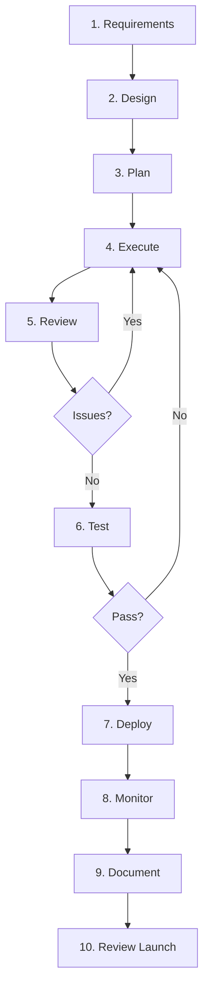

# 🌙 Luna Agents - Complete Installation & Usage Guide

## 📋 Table of Contents

1. [Quick Start](#quick-start)
2. [What Gets Installed](#what-gets-installed)
3. [Package Structure](#package-structure)
4. [Usage Examples](#usage-examples)
5. [Workflow Guide](#workflow-guide)
6. [Distribution](#distribution)
7. [Troubleshooting](#troubleshooting)

---

## 🚀 Quick Start

### Option 1: Automated Setup (Recommended)

```bash
# Step 1: Make scripts executable
chmod +x setup_script.sh final_package_builder.sh

# Step 2: Run the automated setup
./setup_script.sh

# Follow the prompts:
# - It will build the package
# - Ask if you want to install
# - Guide you through testing

# Step 3: Use in any project
cd /path/to/your-project
claude-code --agent ~/luna-agents/luna-requirements-analyzer.md
```

### Option 2: Manual Build & Install

```bash
# Step 1: Build the package
chmod +x final_package_builder.sh
./final_package_builder.sh

# Step 2: Install
cd dist
unzip luna-claude-plugins-v1.0.0.zip
cd luna-claude-plugins
bash install-luna.sh

# Step 3: Verify installation
ls ~/luna-agents/luna-*.md

# Step 4: Use
cd /your-project
claude-code --agent ~/luna-agents/luna-requirements-analyzer.md
```

---

## 📦 What Gets Installed

### Agents Directory: `~/luna-agents/`

```
~/luna-agents/
├── luna-requirements-analyzer.md          # Analyze & generate requirements
├── luna-design-architect.md               # Create technical design
├── luna-task-planner.md                   # Break into tasks
├── luna-task-executor.md                  # Implement code
├── luna-code-review.md                    # Review code quality
├── luna-testing-validation.md             # Test & validate
├── luna-deployment.md                     # Deploy to production
├── luna-documentation.md                  # Generate docs
├── luna-monitoring-observability.md       # Set up monitoring
├── luna-post-launch-review.md             # Post-launch analysis
├── .luna-version                          # Version tracking
└── uninstall.sh                           # Uninstaller script
```

### Commands Directory: `~/.claude/commands/`

```
~/.claude/commands/
├── luna-requirements.md                   # Requirements command
├── luna-design.md                         # Design command
├── luna-plan.md                           # Planning command
├── luna-execute.md                        # Execution command
├── luna-review.md                         # Review command
├── luna-test.md                           # Testing command
├── luna-deploy.md                         # Deployment command
├── luna-docs.md                           # Documentation command
├── luna-monitor.md                        # Monitoring command
├── luna-review-launch.md                  # Review command
└── README.md                              # Commands reference
```

### Total Installation Size
- **Disk Space**: ~50MB
- **Files**: 23 files (10 agents + 11 commands + 2 utilities)
- **Install Time**: ~10 seconds

---

## 📁 Package Structure

After building, you'll have:

```
your-workspace/
├── build/                                 # Build artifacts
│   └── luna-claude-plugins/
│       ├── agents/                        # 10 agent files
│       ├── commands/                      # 11 command files
│       ├── docs/                          # Documentation
│       │   ├── USER_GUIDE.md
│       │   └── QUICK_START.md
│       ├── scripts/                       # Helper scripts
│       ├── install-luna.sh                # Main installer
│       ├── README.md                      # Package README
│       └── LICENSE                        # MIT License
│
├── dist/                                  # Distribution files
│   ├── luna-claude-plugins-v1.0.0.zip     # Distributable package
│   ├── luna-claude-plugins-v1.0.0.zip.sha256  # Checksum
│   └── INSTALLER-INFO.txt                 # Installation instructions
│
├── final_package_builder.sh               # Main build script
├── setup_script.sh                        # One-command setup
└── [your Luna .md source files]           # Source agent files
```

---

## 💡 Usage Examples

### Example 1: Start a New Project

```bash
# 1. Navigate to your project
cd ~/projects/my-new-app

# 2. Generate requirements
claude-code --agent ~/luna-agents/luna-requirements-analyzer.md
# When prompted: Press ENTER (for full project)

# Output: .luna/my-new-app/requirements.md

# 3. Create design
claude-code --agent ~/luna-agents/luna-design-architect.md
# When prompted: Press ENTER

# Output: .luna/my-new-app/design.md

# 4. Plan implementation
claude-code --agent ~/luna-agents/luna-task-planner.md
# When prompted: Press ENTER

# Output: .luna/my-new-app/implementation-plan.md

# 5. Start implementing
claude-code --agent ~/luna-agents/luna-task-executor.md
# When prompted: Press ENTER
# Repeat until all tasks complete

# 6. Continue through workflow...
```

### Example 2: Add Feature to Existing Project

```bash
# Navigate to project
cd ~/projects/existing-app

# Generate requirements for new feature
claude-code --agent ~/luna-agents/luna-requirements-analyzer.md
# When prompted: Type "user-authentication"

# Output: .luna/existing-app/user-authentication/requirements.md

# Design the feature
claude-code --agent ~/luna-agents/luna-design-architect.md
# When prompted: Type "user-authentication"

# Output: .luna/existing-app/user-authentication/design.md

# Plan implementation
claude-code --agent ~/luna-agents/luna-task-planner.md
# When prompted: Type "user-authentication"

# Output: .luna/existing-app/user-authentication/implementation-plan.md

# Implement
claude-code --agent ~/luna-agents/luna-task-executor.md
# When prompted: Type "user-authentication"
# Repeat until done

# Continue through workflow...
```

### Example 3: Multi-Project Usage

```bash
# Project A
cd ~/projects/ecommerce-site
claude-code --agent ~/luna-agents/luna-requirements-analyzer.md
# Creates: .luna/ecommerce-site/

# Project B
cd ~/projects/blog-platform
claude-code --agent ~/luna-agents/luna-requirements-analyzer.md
# Creates: .luna/blog-platform/

# Project C
cd ~/projects/mobile-app
claude-code --agent ~/luna-agents/luna-requirements-analyzer.md
# Creates: .luna/mobile-app/

# Each project has independent Luna files!
```

### Example 4: Parallel Feature Development

```bash
# Terminal 1: Authentication Feature
cd ~/projects/app
claude-code --agent ~/luna-agents/luna-requirements-analyzer.md
# Enter: "authentication"
claude-code --agent ~/luna-agents/luna-design-architect.md
# Enter: "authentication"
claude-code --agent ~/luna-agents/luna-task-executor.md
# Enter: "authentication"

# Terminal 2: Payment Feature (simultaneously)
cd ~/projects/app
claude-code --agent ~/luna-agents/luna-requirements-analyzer.md
# Enter: "payments"
claude-code --agent ~/luna-agents/luna-design-architect.md
# Enter: "payments"
claude-code --agent ~/luna-agents/luna-task-executor.md
# Enter: "payments"

# Result:
# .luna/app/authentication/...
# .luna/app/payments/...
```

---

## 🔄 Workflow Guide

### Complete SDLC Flow



### Phase-by-Phase Breakdown

#### Phase 1: Requirements & Design (Planning)

```bash
# 1. Requirements Analysis
claude-code --agent ~/luna-agents/luna-requirements-analyzer.md
# ✓ Scans codebase
# ✓ Identifies gaps
# ✓ Generates requirements with acceptance criteria
# Output: requirements.md

# 2. Technical Design
claude-code --agent ~/luna-agents/luna-design-architect.md
# ✓ Reads requirements
# ✓ Designs architecture
# ✓ Creates component specs
# Output: design.md

# 3. Task Planning
claude-code --agent ~/luna-agents/luna-task-planner.md
# ✓ Reads design
# ✓ Breaks into tasks
# ✓ Orders by dependencies
# Output: implementation-plan.md with [ ] checkboxes
```

#### Phase 2: Implementation

```bash
# 4. Task Execution (Run Multiple Times)
claude-code --agent ~/luna-agents/luna-task-executor.md
# First run: Completes task 1.1, marks [x]
claude-code --agent ~/luna-agents/luna-task-executor.md
# Second run: Completes task 1.2, marks [x]
claude-code --agent ~/luna-agents/luna-task-executor.md
# Third run: Completes task 1.3, marks [x]
# ... continue until all [ ] become [x]

# ✓ Finds next incomplete task
# ✓ Implements according to design
# ✓ Writes tests
# ✓ Marks complete [x]
# Output: Code files + updated implementation-plan.md
```

#### Phase 3: Quality Assurance

```bash
# 5. Code Review
claude-code --agent ~/luna-agents/luna-code-review.md
# ✓ Reviews all completed tasks
# ✓ Checks security & performance
# ✓ Identifies issues
# Output: code-review-report.md

# Address any critical issues, then:

# 6. Testing & Validation
claude-code --agent ~/luna-agents/luna-testing-validation.md
# ✓ Creates test cases
# ✓ Runs test suites
# ✓ Validates against requirements
# ✓ Checks coverage
# Output: test-validation-report.md
```

#### Phase 4: Deployment & Monitoring

```bash
# 7. Deployment
claude-code --agent ~/luna-agents/luna-deployment.md
# ✓ Verifies readiness
# ✓ Deploys to staging
# ✓ Runs smoke tests
# ✓ Deploys to production
# Output: deployment-report.md

# 8. Monitoring Setup
claude-code --agent ~/luna-agents/luna-monitoring-observability.md
# ✓ Configures monitoring tools
# ✓ Creates dashboards
# ✓ Sets up alerts
# Output: monitoring-observability-report.md
```

#### Phase 5: Documentation & Review

```bash
# 9. Documentation
claude-code --agent ~/luna-agents/luna-documentation.md
# ✓ Generates user guides
# ✓ Creates API docs
# ✓ Writes deployment guides
# Output: docs/ directory

# 10. Post-Launch Review (After 7 Days)
claude-code --agent ~/luna-agents/luna-post-launch-review.md
# ✓ Collects metrics
# ✓ Analyzes performance
# ✓ Reviews incidents
# ✓ Provides recommendations
# Output: post-launch-review.md
```

### Project Directory After Full Workflow

```
your-project/
├── .luna/
│   └── your-project/
│       ├── requirements.md                 # ← Phase 1
│       ├── design.md                       # ← Phase 1
│       ├── implementation-plan.md          # ← Phase 1 & 2
│       ├── code-review-report.md           # ← Phase 3
│       ├── test-validation-report.md       # ← Phase 3
│       ├── deployment-report.md            # ← Phase 4
│       ├── monitoring-observability-report.md  # ← Phase 4
│       └── post-launch-review.md           # ← Phase 5
├── docs/                                   # ← Phase 5
│   ├── user-guide/
│   ├── developers/
│   ├── api/
│   └── operations/
├── src/                                    # ← Phase 2
│   └── [your implemented code]
├── tests/                                  # ← Phase 3
│   └── [generated tests]
└── package.json
```

---

## 📤 Distribution

### For End Users

Share the complete package:

```bash
# Package is ready in dist/
dist/
├── luna-claude-plugins-v1.0.0.zip          # ← Share this
├── luna-claude-plugins-v1.0.0.zip.sha256   # ← And this (checksum)
└── INSTALLER-INFO.txt                      # ← And this (instructions)
```

#### End User Installation

```bash
# 1. Download and extract
unzip luna-claude-plugins-v1.0.0.zip
cd luna-claude-plugins

# 2. Install
bash install-luna.sh

# 3. Verify
ls ~/luna-agents/luna-*.md

# 4. Use
cd /their-project
claude-code --agent ~/luna-agents/luna-requirements-analyzer.md
```

### Distribution Channels

1. **GitHub Releases**
   ```bash
   gh release create v1.0.0 dist/luna-claude-plugins-v1.0.0.zip
   ```

2. **Direct Download**
   - Upload ZIP to your website
   - Share download link
   - Include SHA256 for verification

3. **Package Managers** (Future)
   - Homebrew formula
   - npm package
   - Claude plugin marketplace

---

## 🔧 Troubleshooting

### Issue: Build Script Fails

**Problem**: `./final_package_builder.sh` exits with error

**Solutions**:

```bash
# Check for missing files
ls luna-*.md

# Ensure you have all 9-10 agent files
# Required files listed in error message

# Make script executable
chmod +x final_package_builder.sh

# Run with verbose output
bash -x final_package_builder.sh
```

### Issue: Agent Not Found

**Problem**: `claude-code: agent file not found`

**Solutions**:

```bash
# Check installation
ls ~/luna-agents/luna-*.md

# If empty, reinstall
bash ~/luna-agents/uninstall.sh
cd luna-claude-plugins && bash install-luna.sh

# Use absolute path
claude-code --agent ~/luna-agents/luna-requirements-analyzer.md
```

### Issue: Permission Denied

**Problem**: `Permission denied` when running agents

**Solutions**:

```bash
# Fix agent permissions
chmod +x ~/luna-agents/*.md
chmod 755 ~/luna-agents/

# Fix command permissions
chmod +x ~/.claude/commands/*.md
chmod 755 ~/.claude/commands/
```

### Issue: Files Not Created

**Problem**: Agent runs but no `.luna/` files created

**Solutions**:

```bash
# Check you're in project root
pwd

# Check directory permissions
ls -la .

# Manually create .luna if needed
mkdir -p .luna/$(basename $(pwd))

# Re-run agent
claude-code --agent ~/luna-agents/luna-requirements-analyzer.md
```

### Issue: Wrong Project Name

**Problem**: Files created in wrong `.luna/` subdirectory

**Cause**: Luna uses current directory name as project name

**Solutions**:

```bash
# Check current directory name
basename $(pwd)

# This becomes the project folder name in .luna/
# Example: If you're in /Users/me/projects/my-app
# Files go to: .luna/my-app/

# To use different name, rename project directory
```

### Issue: Incomplete Installation

**Problem**: Some agents missing after installation

**Solutions**:

```bash
# Count agents
ls ~/luna-agents/luna-*.md | wc -l
# Should show 10

# If less, reinstall
bash ~/luna-agents/uninstall.sh
cd dist/luna-claude-plugins
bash install-luna.sh

# Verify all present
ls -1 ~/luna-agents/luna-*.md
```

### Issue: Claude Code Not Found

**Problem**: `claude-code: command not found`

**Solutions**:

```bash
# Install Claude Code
# Visit: https://claude.ai/code

# Or check if it's in PATH
which claude-code

# If installed but not in PATH, use full path
/path/to/claude-code --agent ~/luna-agents/luna-requirements-analyzer.md
```

---

## 📚 Additional Resources

### Documentation Locations

After installation:

```bash
# Commands reference
cat ~/.claude/commands/README.md

# User guide (in package)
cat dist/luna-claude-plugins/docs/USER_GUIDE.md

# Quick start (in package)
cat dist/luna-claude-plugins/docs/QUICK_START.md

# Agent documentation (in each .md file)
cat ~/luna-agents/luna-requirements-analyzer.md
```

### Getting Help

1. **Check Documentation**: Start with command README
2. **Review Agent Files**: They contain complete instructions
3. **Check Build Logs**: Look for errors during build
4. **Verify Installation**: Ensure all files present
5. **Test in Fresh Project**: Rule out project-specific issues

### Uninstallation

```bash
# Quick uninstall
bash ~/luna-agents/uninstall.sh

# Complete removal
rm -rf ~/luna-agents
rm -rf ~/.claude/commands/luna-*.md
rm -rf ~/.claude/commands/README.md

# Remove from projects (optional)
# Each project has independent .luna/ directory
# Delete manually if desired
```

---

## 🎉 Success Checklist

After setup, verify:

- ✅ Build completed without errors
- ✅ ZIP file created in `dist/`
- ✅ Installation completed successfully
- ✅ 10 agents in `~/luna-agents/`
- ✅ 11 commands in `~/.claude/commands/`
- ✅ Can run an agent in a test project
- ✅ `.luna/` directory created in test project
- ✅ Requirements file generated successfully

---

## 🚀 You're Ready!

Luna Agents is now installed and ready to use. Start with any project:

```bash
cd /your-project
claude-code --agent ~/luna-agents/luna-requirements-analyzer.md
```

🌙 **Happy coding with Luna!**
